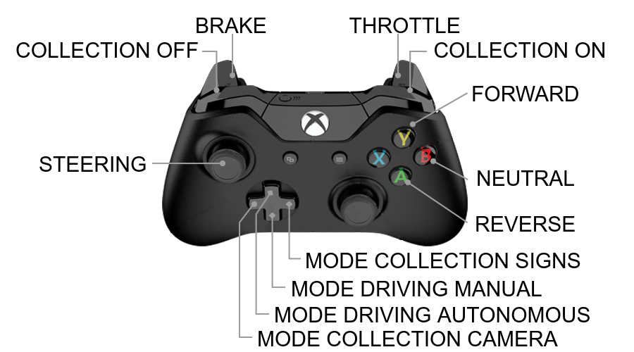

# Prius Autonomous Vehicle
ROS Noetic project for an autonomous vehicle. 

The project is based on [OSRF Car Demo](https://github.com/osrf/car_demo).
The provided nodes allow for autonomous driving in the generated Gazebo world.
It is part of my master's thesis from the year 2020. The main emphasis is around implementation of:
* [End to End Learning for Self-Driving Cars](https://arxiv.org/abs/1604.07316) for autonomous driving, 
* [YOLOv3](https://arxiv.org/abs/1804.02767) for traffic sign detection,
* Some CNN for traffic sign recognition.

https://user-images.githubusercontent.com/37396312/178082511-bd6b2e84-f7ec-4949-a084-e6311943acb7.mp4

Here you can:
* Quickly create a Gazebo world using window app, 
* Collect dataset (vehicle camera & traffic signs),
* Train neural networks (self-driving, traffic sign detection, traffic sign recognition),
* Tune PID,
* Drive manually or autonomously with simple GUI.

Some time ago I used this repo for lab classes about autonomous vehicles. Now you may find
better ROS based project in this area for sure.

# Requirements
* [Docker](https://docs.docker.com/engine/install/ubuntu/)
* [Nvidia-docker2](https://docs.nvidia.com/datacenter/cloud-native/container-toolkit/install-guide.html#setting-up-nvidia-container-toolkit)
* [Rocker](https://github.com/osrf/rocker#debians-recommended)
* Xbox controller

# Installation
## Configure
```
git clone https://github.com/amadeuszsz/prius_av
cd prius_av
```
Modify your IDEs paths within `run.sh` and `docker/entrypoint` files. If you are not going to work with IDE,
remove its occurrence within mentioned files.

## Build docker image
```
cd docker
./build.sh
```

## Create container
Connect joy creating running container!
```
cd ..
./run.sh
```
To run another terminal use `./enter.sh` script.

## Build workspace
You must be in a container.
```
cd prius_av
sudo apt-get update
vcs import < prius_av.repos
rosdep install --from-paths src --ignore-src -yr
catkin build --cmake-args -DCMAKE_BUILD_TYPE=Release -DCMAKE_EXPORT_COMPILE_COMMANDS=1
```

You may generate `compile_commands.json` for C++ IDE development:
```
./merge_compile_commands.sh
```
Use output file while opening the project (e.g. in CLion).

## Pull pretrained models & datasets
Download [prius_av.zip](https://drive.google.com/file/d/1DEaqcHfNvmmOQ3rkH7kyYEPgv8ksW_n6/view?usp=sharing), unpack
and override with cloned repository. Provided directory contains pretrained models for steering control (without dataset),
traffic sign detection (with dataset) and traffic sign recognition (with dataset). Dataset for control steering can be
easily collected with `prius_av` functionality.


# Usage
## Run prius_av
You must be in a container.
```
cd prius_av
source devel/setup.bash
roslaunch prius_control prius_av.launch
```
Use joy to control the vehicle. First launch will take some time due to download of the Gazebo models.



## Collect dataset
### Front camera - steering control NN
To collect images from front camera: drive in manual mode, set mode collection as camera and turn on collection.

### Signs - traffic sign detection NN
See [docs](https://github.com/amadeuszsz/yolov3-tf2/blob/open_images/docs/training_open_images_v6.md).

### Signs - traffic sign recognition NN
To collect images from traffic sign detection output: drive in autonomous mode, set mode collection as signs and
turn on collection. This case assume already delivered models for control steering and traffic signs detection.
To speedup labeling, use `signs.world` as a gazebo map. For each sign replace all occurrences of specific sign name
(e.g. speed_limit_sign_120 -> speed_limit_sign_100) and run it again. After every single attempt just move collected
signs images to appropriate directory (e.g. data/sign -> data/signs/sign_100).

## Train
It is possible to train model despite already pulled models.
### Steering control NN
Run [control_train](src/prius_vision/scripts/control_train.py)
```
cd src/prius_vision/scripts
python3 control_train.py
```

### Traffic sign detection NN
See [docs](https://github.com/amadeuszsz/yolov3-tf2/blob/open_images/docs/training_open_images_v6.md).

### Traffic sign recognition NN
Run [sign_recognition_train](src/prius_vision/scripts/sign_recognition_train.py).

```
cd src/prius_vision/scripts
python3 sign_recognition_train.py
```

## Create custom Gazebo world
Run map creator.
```
rosrun prius_tools map_creator
```
See terminal prompt for instructions.

## Tune PID
```
roslaunch prius_control tune_pid.launch
```
Tune parameters and follow output plot. The vehicle switch between two target setpoints every 5 seconds.
You can set new parameter in main [launch file](src/prius_control/launch/prius_av.launch).

# Known issues
* Wireless joy connection issue.

    You may not be able to pair the controller before entering docker container. Fix it on host level.

    ```
    sudo apt install sysfsutils
    ```
    
    Edit `/etc/sysfs.conf` (as root), add this line at the end of the file:
    
    ```
    /module/bluetooth/parameters/disable_ertm=1 
    ```
    
    Restart computer.
